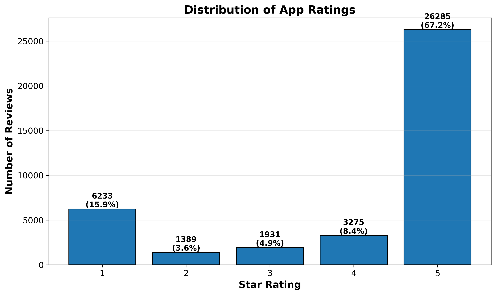

# 📱 Ethiopian Banking Apps Review Analysis

[](https://www.python.org/)
[](https://pandas.pydata.org/)
[](https://opensource.org/licenses/MIT)

## 📊 Project Overview

This project analyzes **39,113 user reviews** from 12 Ethiopian banking and financial apps on the Google Play Store.

## 🔑 Key Findings

| Metric | Value |
|--------|-------|
| **Total Reviews Analyzed** | 39,113 |
| **Apps Analyzed** | 12 |
| **Average Rating** | 4.07/5.0 ⭐ |
| **Positive Reviews (4-5★)** | 29,560 (75.6%) |
| **Negative Reviews (1-2★)** | 7,622 (19.5%) |
| **Neutral Reviews (3★)** | 1,931 (4.9%) |

## 📱 Apps Analyzed

| # | App Name | Reviews |
|---|----------|---------|
| 1 | Telebirr | 16,582 |
| 2 | CBE Mobile Banking | 9,825 |
| 3 | Awash Birr Pro | 3,412 |
| 4 | CBE Birr | 2,307 |
| 5 | Apollo (BoA) | 2,080 |
| 6 | eBirr | 1,637 |
| 7 | Bank of Abyssinia | 1,450 |
| 8 | Dashen Bank | 1,050 |
| 9 | Cooperative Bank of Oromia | 241 |
| 10 | NIB Bank | 235 |
| 11 | Oromia Bank | 165 |
| 12 | Awash Bank | 129 |

## 📈 Rating Distribution



## 🛠️ Technologies Used

- **Python** - Core programming
- **google-play-scraper** - Data extraction
- **Pandas** - Data analysis
- **Matplotlib** - Visualization
- **Jupyter Notebook** - Development

## 🚀 How to Run

```bash
# Install dependencies
pip install pandas google-play-scraper matplotlib

# Run the notebook
jupyter notebook ethiobankreview.ipynb
```
